# Drawing
第 1 章中展示的视图大多只是一些带背景色的矩形块，仅仅设置了 backgroundColor，并没有其他内容。但真实的 iOS 应用并不是这样。用户在屏幕上看到的一切都是 UIView，而这些界面远不止一堆彩色矩形那么简单。之所以丰富，是因为这些视图都有“内容”——它们内部包含了绘图。

很多 UIView 的子类，比如 UIButton 或 UILabel，本身就带有绘图能力，知道该如何把自己画出来。但迟早你也会需要自己动手进行绘图。你可以提前准备好一张图片文件，也可以在应用运行时通过代码动态绘制图像。你还可以使用能显示图片的 UIView 子类，比如 UIImageView 或 UIButton，来展示这些图像。而一个纯粹的 UIView，本质上就是一个用于绘图的容器，绘什么几乎完全取决于你。它本身不会自动显示什么内容，具体展示什么，完全由你在代码中决定，因此它在界面中呈现出的样子，也就完全由你的绘图逻辑决定。

本章将讲解绘图的基本机制。不要害怕自己写绘图代码！这其实并不难，而且很多时候这是让你的应用实现理想外观的最佳方式。（至于如何绘制文字，我会在第 10 章中详细讲解。）

## Images and Image Views
UIKit 中用于处理图像的基本类是 UIImage。它可以识别和处理多种常见的图像格式，比如 HEIC、TIFF、JPEG、GIF 和 PNG。UIImage 可以用在任何需要显示图像的地方，它负责提供图像数据，你可以把它简单理解为是对图像数据的封装。除了图像本身，它还包含一些附加信息，并允许你调整图像的某些行为表现。

UIImage 中的图像数据通常来自以下三种主要来源：
 * 来自磁盘上的已有图像文件
 * 应用在运行时通过代码绘制生成的图像
 * 从网络下载得到的图像数据

本章将重点讲前两种情况：磁盘中的图像文件，以及运行时绘制生成的图像。而关于如何从网络下载图像数据，会在第 23 章中讲解。

### Image Files
UIImage 可以读取磁盘上的图像文件，所以如果某张图片不需要在运行时动态生成，而是你在开发阶段就已经准备好了，那么绘图的过程可能就非常简单——只需要把这张图片作为资源包含在应用中即可。在包含图片资源时，iOS 对 PNG 文件有天然的支持，因此建议尽可能使用 PNG 格式的图片。（相反的操作——把图像数据保存为文件——将在第 22 章中讲解。）

应用包（bundle）中已有的图像文件，最常见的获取方式是使用 UIImage 的初始化方法 `init(named:)`。它接收一个字符串作为参数，返回一个可选类型的 UIImage（因为图像可能不存在）。这个方法会在两个位置查找对应的图像文件：
1. Asset catalog  
首先会在资源目录（Asset Catalog）中查找是否存在与传入名称匹配的图像集合（image set）。这个名称是区分大小写的。
2. Top level of app bundle  
其次，会在应用包（App Bundle）的顶层目录查找与给定名称匹配的图像文件。这个名称同样区分大小写，并且建议包含文件扩展名；如果你没有写扩展名，系统默认会查找 `.png` 格式的文件。

调用 `init(named:)` 时，系统会优先搜索资源目录（Asset Catalog），然后才会查找应用包的顶层目录。如果项目中存在多个资源目录，系统会遍历所有目录进行查找，但查找的顺序是不确定的。因此，不要在不同的资源目录中使用相同的图像名称，以避免加载到错误的图像。

> Image library 会列出资源目录中的图片以及应用包顶层的图片。与其手动输入字符串调用 `init(named:)`（这可能会打错字），你也可以直接从 Image library 拖拽或双击一张图片，在代码中插入一个图像字面量。这个图像字面量对应的是对 UIImage 初始化方法 `init(imageLiteralResourceName:)` 的调用，它返回一个 UIImage，而不是 Optional 类型。

使用 `init(named:)` 加载图像时，系统可能会将图像数据缓存在内存中。如果你之后再次通过 `init(named:)` 请求同一张图片，系统可能会直接返回缓存的数据。这种缓存机制通常是有益的，因为从磁盘读取图像并将其解码成可用的位图数据是一项开销较大的操作。

不过，有时候你可能并不希望使用缓存。如果你确定这张图片只会加载一次，并且立刻用在界面上，那么缓存反而可能会给应用带来不必要的内存压力。在这种情况下，你可以用另一种方式加载图片：通过调用 `init(contentsOfFile:)` 方法，直接从应用包中（注意不是资源目录）读取图像文件，而且不会使用缓存。这个方法需要一个路径字符串。你可以通过 `Bundle.main` 获取当前应用的 `bundle`，然后用它提供的方法（比如 `path(forResource:ofType:)`）来获取文件的路径。

#### Hardware-related image variants
一张图片文件可以有多个变体，以适配不同的硬件设备。当图片保存在应用包`Bundle`中时，这些变体通过文件名中的特殊后缀来区分：
* 高分辨率变体
在具有双倍分辨率屏幕的设备上，当你通过名称从应用包中加载图像时，系统会自动使用带有 @2x 后缀的文件（如果存在）。加载后的 `UIImage` 会被标记为双倍分辨率，其 `scale` 属性为 2.0。同理，在三倍分辨率的设备上，系统会使用带 @3x 后缀的文件，并将对应 `UIImage` 的 `scale` 属性设为 3.0。
图像文件的双倍和三倍分辨率版本，其像素尺寸应当分别是基础版本的两倍和三倍。但由于 `UIImage` 的 `scale` 属性，高分辨率图像在逻辑上的 `CGSize` 与单倍分辨率图像是相同的。因此，在高分辨率屏幕上，你的代码和界面不需要做任何改动，图像就会自动显示得更加清晰。
这种机制适用于 `UIImage` 的 `init(named:)` 和 `init(contentsOfFile:)` 方法。如果你的应用包中同时存在名为 `pic.png` 和 `pic@2x.png` 的文件，那么在双倍分辨率的设备上，这两个方法都会优先加载 `pic@2x.png`，并生成一个 `scale` 为 2.0 的 `UIImage`。
```swift
let im = UIImage(named:"pic") // uses pic@2x.png
if let path = Bundle.main.path(forResource: "pic", ofType: "png") {
    let im2 = UIImage(contentsOfFile:path) // uses pic@2x.png
}
```
* 设备类型变体
如果图片文件名加上 \~ipad 后缀，当应用在 iPad 上原生运行时，系统会自动使用这个文件。在通用应用中（即同时支持 iPhone 和 iPad 的应用），你可以利用这个机制，根据设备类型自动加载不同的图像资源。这种后缀机制不仅适用于图像资源，也适用于通过名称从应用包中获取的任何资源。具体细节可以参考 Apple 文档中的 Resource Programming Guide。
这种机制适用于 `UIImage` 的 `init(named:)` 方法和 `Bundle` 的 `path(forResource:ofType:)` 方法。如果应用包中同时存在名为 `pic.png` 和 pic\~ipad.png 的文件，那么在 iPad 上运行时，这两个方法会优先加载 pic\~ipad.png。
```swift
let im = UIImage(named:"pic") // uses pic~ipad.png
let path = Bundle.main.path(forResource: "pic", ofType: "png") // uses pic~ipad.png
```
不过，如果可以的话，你可能更倾向于将图像资源放在资源目录（asset catalog）中，而不是直接放在应用包中。这样做的一个显著优点就是：你不再需要记住各种文件名后缀的命名规则。资源目录会根据图像在目录中的位置来判断何时使用哪个变体，而不是依赖文件名。
* 将单倍、双倍和三倍分辨率的图像分别放入资源目录中标记为“1x”、“2x”、“3x”的位置。
* 如果你想为 iPad 提供不同版本的图像，可以在资源目录中选中该图像集，在属性检查器中勾选 iPhone 和 iPad，系统会为这两种设备类型分别提供插槽。
* 资源目录中的图像集还能根据设备的处理器类型、广色域支持等特性进一步区分使用哪一张图像。

这些资源区分方式不仅在应用运行时由系统决定使用哪张图像，也会被 App Store 用来在应用发布时为特定设备进行“瘦身处理”，只保留目标设备需要的资源，从而减少应用体积。

#### Vector images
资源目录中的图像文件可以是基于矢量的 PDF 文件。
* 如果你将资源目录中的 `Scales` 选项设置为 `Single Scale`，并将图像放入单一的插槽中，系统会自动为双倍或三倍分辨率进行缩放。由于这是矢量图像，缩放后的图像仍然会保持清晰。
* 如果你将资源目录中的 `Scales` 选项设置为 `Individual` 和 `Single Scales`，并将图像放入 “1x” 插槽，同时勾选该插槽的 `Preserve Vector Data `选项，那么这张图像在被缩放时（无论是被 UIImageView 或其他界面元素自动缩放，还是你在代码中通过重绘方式进行缩放），都会保持清晰。

在 Xcode 11 和 iOS 13 中新增了一项功能：系统内置了 1500 多个标准命名的 SVG 符号图像，可用于图标或与文本搭配使用。你可以通过调用 `UIImage` 的初始化方法 `init(systemName:)` 在代码中获取这些图像。所有符号图像及其名称可以在 Apple 提供的 SF Symbols 应用中查看并下载使用。

有些符号图像非常常用，因此 UIImage 直接提供了对应的类属性，例如：`.add`、`.remove`、`.close`、`.actions`、`.checkmark` 和 `.strokedCheckmark`。在 `nib` 编辑器中，像 UIButton 这类可以设置图像的界面元素，也支持通过下拉菜单选择符号图像，只需输入图像名称即可。

符号图像的绘制细节可以通过 `symbolConfiguration（UIImage.SymbolConfiguration）`来控制。你可以在创建图像时就指定这个配置，或者之后通过 `UIImage` 的实例方法 `.withConfiguration(_:)` 或 `.applyingSymbolConfiguration(_:)` 来修改。另外，你也可以将符号配置直接设置到显示该图像的 `image view` 上。配置内容可以包括：九种图像粗细（weight）、三种缩放比例（scale）、字体或文字样式，以及点大小等不同组合。这些配置的设计初衷是为了方便符号图像与文字的搭配使用。关于这部分内容，我会在第 10 章中详细讲解。

#### Asset catalogs and trait collections
资源目录可以根据不同的特征集合（Trait Collection）区分同一资源的不同版本。你最常需要做的区分通常包括界面的尺寸类别（Size Class）或用户界面风格（浅色模式和深色模式）。

假设你有一张图像，需要根据不同的尺寸类别显示不同的版本。在资源目录中选中这张图像后，可以在属性检查器中使用 `Width Class` 和 `Height Class` 的下拉菜单，来设置你希望提供哪些尺寸类别的图像版本。比如，在 iPhone 横屏状态下运行应用时，如果图像集中同时存在 `Any Height` 和 `Compact Height` 两个版本，系统会自动使用 `Compact Height` 的图像。而当设备从横屏旋转为竖屏时，系统会立即把界面上的图像从 `Compact Height` 切换为 `Any Height`。这一切都是实时发生的，由系统自动完成，无需你手动干预。

同样的，图像也可以根据当前环境是浅色模式还是深色模式显示不同的版本。要设置这种区分方式，可以在资源目录中选中图像后，在属性检查器中通过 `Appearance` 下拉菜单进行设置。如果你选择 `Any, Dark`，就会出现两个插槽：一个用于浅色模式或未指定模式，另一个用于深色模式，这通常就是你所需要的配置。从资源目录中获取的 `UIImage` 是动态的，当用户切换界面风格时，图像会自动切换到对应的版本。而且，在资源目录中定义的命名颜色也可以做同样的区分，从而成为动态颜色（这一点在第 1 章中已经介绍过）。

如果你想从资源目录中获取某个特定特征集合下的图像或命名颜色，并且你知道它的名字，可以使用 `init(named:in:compatibleWith:)` 方法，其中第三个参数就是你要指定的特征集合（`trait collection`）。但如果你已经拥有了一个 `UIImage` 或 `UIColor` 实例，却不知道它的名称，又该怎么办？再进一步说，你的应用在运行中已经加载了图像或颜色，当系统的特征集合（比如界面风格）发生变化时，这些图像和颜色是如何自动切换到对应版本的呢？这个“魔法”其实是 `UIImage` 和 `UIColor` 自身的内建特性。它们内部已经包含了对特征变化的响应机制，因此在系统外观变化时，它们能自动更新为适配的新版本，无需你手动处理。

我们先从 `UIImage` 说起。当你通过 `UIImage` 的 `init(named:)` 方法从资源目录中加载一张图片时，它的 `imageAsset` 属性会是一个 `UIImageAsset`，这个对象本质上是一个指向资源目录中对应图像集的引用。图像集中每一张图像都有一个与之关联的特征集合（traitCollection）。你可以通过调用 `UIImageAsset` 的 `image(with:)` 方法，传入一个特定的特征集合，来获取这个图像集中对应该特征的那一张图片。换句话说，你可以根据需要，从同一个图像集里手动获取不同特征对应的图像版本。

像 `UIImageView` 这样的系统内置图像显示控件，会自动感知特征集合（`trait collection`）的变化。它会接收到 `traitCollectionDidChange(:)` 消息，并自动根据当前环境更新显示的图像。为了演示这个机制的底层原理，我们可以自定义一个 `UIView`，并给它添加一个 `image` 属性，使它在特征变化时具备相同的响应能力。
```swift
class MyView: UIView {
    var image : UIImage!
    override func traitCollectionDidChange(_ prevtc: UITraitCollection?) {
        super.traitCollectionDidChange(prevtc)
        self.setNeedsDisplay() // causes draw(_:) to be called
    }
    override func draw(_ rect: CGRect) {
        if var im = self.image {
            if let asset = self.image.imageAsset {
                im = asset.image(with:self.traitCollection)
            }
            im.draw(at:.zero)
        }
    }
}
```
真正有趣的是，这种特征感知机制并不一定非得依赖资源目录。你完全可以让多张图像在不同特征集合下作为彼此的替代，而不使用 asset catalog。这种做法适用于你在运行时动态生成图像，或者从网络上获取图像的情况。关键在于：你可以手动创建一个 `UIImageAsset`，然后将不同的 `UIImage` 与各自对应的 `trait collection` 注册到这个 `UIImageAsset` 中。下面是一个示例说明这个用法。
```swift
let tcreg = UITraitCollection(verticalSizeClass: .regular)
let tccom = UITraitCollection(verticalSizeClass: .compact)
let moods = UIImageAsset()
let frowney = UIImage(named:"frowney")!
let smiley = UIImage(named:"smiley")!
moods.register(frowney, with: tcreg)
moods.register(smiley, with: tccom)
```
神奇的是，如果我们现在将 `frowney` 或 `smiley` 中的任意一个显示在 `UIImageView` 中，最终显示的图像会自动根据当前环境的垂直尺寸类别（`vertical size class`）来决定，呈现出对应的图像版本。换句话说，`UIImageView` 会根据当前 `trait collection`，从 `UIImageAsset` 中自动选择合适的图像，无需额外处理。

`UIColor` 的机制更简单一些，它没有类似 `UIImageAsset` 那样的 `UIColorAsset`类。要声明一个动态颜色，可以使用 `init(dynamicProvider:)` 方法，它接收一个函数作为参数，这个函数根据传入的 `trait collection` 返回对应的颜色。也就是说，动态颜色内部就包含了与特征集合对应的颜色逻辑。如果你想手动获取某个特征集合下的实际颜色，可以调用 `resolvedColor(with:)` 方法，并传入对应的 `trait collection`。

#### Namespacing image files
当图像文件数量众多，或者需要按功能进行分组时，就会涉及如何为它们划分命名空间的问题。以下是几种常见的做法：
1. Folder reference  
你不必把所有图片都放在应用包的顶层目录下，也可以将它们放在一个专门的文件夹中。最方便的方式是将该文件夹作为“文件夹引用”添加到你的项目中。这样在构建时，整个文件夹以及其中的所有内容会被原样复制进应用包。在代码中，有多种方式可以从这样的文件夹中读取图像：
* 可以使用 `UIImage` 的 `init(named:)` 方法，传入包含文件夹名称的路径字符串。在字符串中使用斜杠表示路径。例如，如果文件夹名为 `pix`，图片文件名为 `pic.png`，那么你传入的名称应为 `"pix/pic.png"`。这表示你要从 `pix` 文件夹中加载名为 `pic.png` 的图片。
* 你也可以先使用 `Bundle` 的方法 `path(forResource:ofType:inDirectory:)` 获取图片文件的路径，然后再通过 `UIImage` 的 `init(contentsOfFile:)` 方法加载图像。这样可以精确地从指定文件夹中读取图片，而不依赖于资源缓存机制。
* 你还可以先获取应用包的路径（使用 Bundle.main.bundlePath），然后结合 NSString 的路径拼接方法或 `FileManager` 的相关方法，逐级定位到目标图片文件的位置。这种方式更底层、灵活性也更高，适用于需要自定义路径解析逻辑的场景。
2. Asset catalog folder  
资源目录也可以通过“虚拟文件夹”来实现命名空间的功能。假设你在资源目录中有一个名为 `pix` 的文件夹，里面包含一个图像集 `myImage`，如果你在该文件夹的属性检查器中勾选了 `“Provides Namespace”` 选项，那么你就可以通过 `UIImage` 的 `init(named:)` 方法，用名称 `"pix/myImage"` 来访问这个图像。
3. Bundle  
`init(named:)` 方法还有一个更完整的形式是 `init(named:in:)`，其中第二个参数是一个 `bundle`。通过这种方式，你可以将图像资源放在另一个独立的 `bundle` 中，比如某个 `framework`，然后通过指定该 `bundle` 来实现图像的命名空间管理。这种做法适用于所有图像来源，无论图像是在资源目录中，还是直接位于 `bundle` 的顶层目录，都可以使用该方法进行访问。

#### Image files in the nib editor
许多内建的 `Cocoa` 界面元素在绘制时都可以接受 `UIImage`。例如，`UIButton` 可以显示一张图片，`UINavigationBar` 或 `UITabBar` 可以设置背景图（第 12 章会详细讲解），等等。而你要提供的这些图像，通常都是来自图像文件。

`nib` 编辑器也为你提供了方便的图像设置方式。对于可以设置图像的界面元素，在其属性检查器中会有一个下拉菜单，你可以从中选择项目中的图片，或者（iOS 13 起）选择系统内置的符号图像。此外，你项目中的图片以及系统符号图像也都会显示在 `Image library` 中，你可以从中直接将图像拖拽到画布上的某个界面对象上，比如按钮。

### Image Views
当你想在界面中单纯显示一张图片（不是作为按钮或其他控件的一部分），通常会使用 `UIImageView` 来呈现。`UIImageView` 是专门用来显示图片的视图，它在图像显示方面最为灵活、功能也最全面。在代码中，只需将图片赋值给 `image view` 的 `image` 属性即可。而在界面编辑器（`nib` 编辑器）中，你可以从资源库（`Image library`）中拖拽图片到 `UIImageView` 上，或者通过属性面板中的 `Image` 下拉菜单设置图片。你也可以直接把图片拖到一个普通的 `UIView` 上，这样系统会自动创建一个 `UIImageView`，并将该图片作为它的内容。

> 从 iOS 13 开始，`UIImageView`（或者 `UIButton`，因为它内部的图片也是放在一个 `UIImageView` 中）可以通过设置 `preferredSymbolConfiguration` 来显示某个符号图像（`symbol image`）的特定变体。你可以在代码里设置，也可以在 `nib` 编辑器中进行设置。

一个 `UIImageView` 实际上可以同时拥有两张图像，一张赋值给它的 `image` 属性，另一张赋值给它的 `highlightedImage` 属性。具体显示哪一张图像，取决于 `UIImageView` 的 `isHighlighted` 属性的值。不过，`UIImageView` 并不会像按钮那样，当用户点击时自动高亮显示。但是在某些场景下，`UIImageView` 会对其所在环境的高亮状态作出响应；例如在表格单元格（table view cell）中，当单元格被高亮时，`UIImageView` 会显示它的高亮图像（详细见第8章）。

`UIImageView` 是 `UIView` 的子类，因此除了可以显示图像之外，还可以设置背景颜色、透明度（`alpha`）等属性（详见第1章）。一张图像本身可能包含透明区域，`UIImageView` 会保留并正确显示这些透明区域，因此任意形状的图像都能按预期显示出来。如果 `UIImageView` 没有设置背景色，那么它除了图像以外是完全透明的，用户在界面上看到的只是图像本身，而不会察觉到它实际上是嵌套在一个矩形视图中。如果 `UIImageView` 既没有图像也没有背景色，那它就是不可见的。因此，你可以在需要图像的位置先放置一个空的 `UIImageView`，然后在后续的代码中再给它赋值图像。你可以给 `UIImageView` 的 `image` 属性赋一个新的图像来替换原有图像，也可以把 `image` 属性设为 `nil` 来移除当前图像。

`UIImageView` 如何绘制其图像，取决于它的 `contentMode` 属性（`UIView.ContentMode`）；这个属性实际上是从 `UIView` 继承而来的，本章后面我会介绍它更通用的用途。 `.scaleToFill` 表示将图像的宽度和高度拉伸到与视图的宽高一致，完全填充视图，即使这会改变图像的宽高比（`aspect ratio`）。 `.center` 表示图像会居中显示在视图中，但不会改变其原始尺寸。最常用的是 `.scaleAspectFit` 和 `.scaleAspectFill`：它们都会保持图像的原始宽高比，同时尽量填充 `UIImageView`。不同之处在于，`.scaleAspectFill` 会在两个维度上都填满视图，这可能导致部分图像超出 `UIImageView` 的边界。理解各`contentMode` 设置最好的方法，就是在 nib 编辑器里做实验：在 `UIImageView` 的 Attributes Inspector 中，通过切换 Content Mode 下拉菜单，观察图像是如何绘制和摆放的。

你还需要注意 `UIImageView` 的 `clipsToBounds` 属性；如果这个属性为 `false`，那么如果图片本身比 `UIImageView` 大、并且 `contentMode` 也没有把图片缩小，整张图片也可能会完整显示出来，超出 `UIImageView` 的边界。

在使用代码创建 `UIImageView` 时，你可以利用它的便利构造器 `init(image:)`。
 默认情况下，`contentMode` 是 `.scaleToFill`，但图像最初并不会被缩放，而是 `UIImageView` 的大小会自动匹配图像的尺寸。不过，你通常还需要 `UIImageView` 在其父视图中正确定位。在这个示例中，我会把一张火星的图片放到应用界面的中央（见图 2-1；关于 `CGRect` 的 `center` 属性，请参考附录 B）。
 ```swift
let iv = UIImageView(image:UIImage(named:"Mars"))
self.view.addSubview(iv)
iv.center = iv.superview!.bounds.center
iv.frame = iv.frame.integral
 ```
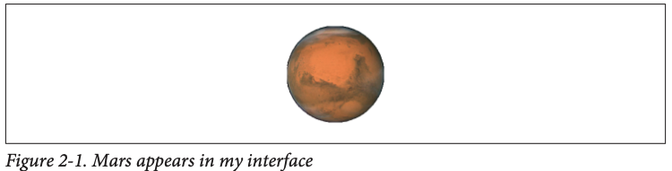

当你给一个已有的 `UIImageView` 设置新的图像时，它的尺寸是否会改变，取决于该 `UIImageView` 是否使用了自动布局（Auto Layout）。在自动布局下，图像的大小会成为 `UIImageView` 的 `intrinsicContentSize`（固有内容尺寸），因此除非有其他约束限制，否则 `UIImageView` 会采用新图像的尺寸。

一个 `UIImageView` 会自动从它的图像获取 `alignmentRectInsets`（见第 1 章）。
 如果你打算用 Auto Layout 把这个 `UIImageView` 和其他对象对齐，你可以给图像设置合适的 `alignmentRectInsets`，`UIImageView` 就会按照这个偏移来正确对齐。在代码中，你可以通过调用原图像的 `withAlignmentRectInsets(_:)` 方法派生出一个带有新的对齐内边距的图像；或者，你也可以在资源目录（Asset Catalog）里设置图像的 `alignmentRectInsets`（用四个 `Alignment` 输入框来配置）。

### Resizable Images
某些界面场景下，需要图像能够在任意尺寸下保持合理拉伸。例如，用作滑块或进度视图轨道的自定义图像（第12章）必须能够填充任意长度的区域。这类图像就称为可拉伸图像。

在代码中创建可拉伸图像时，只需从一个普通的 `UIImage` 开始，调用它的 `resizableImage(withCapInsets:resizingMode:)` 方法。其中 `capInsets` 参数是一个 `UIEdgeInsets`，表示从图像四个边缘向内的距离。在比图像本身更大的绘制区域中，可拉伸图像会根据 `resizingMode（UIImage.ResizingMode）`的不同表现出两种不同的拉伸方式：
* `.tile`：可拉伸图片的内部矩形区域（由 `inset` 定义）会在内部以平铺（重复）的方式填充；每条边会通过平铺 `inset` 外侧对应的边缘矩形来形成。位于 `inset` 外侧的四个角区域会保持不变，不会被拉伸或平铺。
* `.stretch`：可拉伸图片的内部矩形区域（由 `inset` 定义）会被拉伸一次以填充内部空间；每条边则通过拉伸 `inset` 外侧对应的边缘矩形来形成。位于 `inset` 外侧的四个角区域保持不变，不会被拉伸。

在下面的示例中，假设 `self.iv` 是一个 `UIImageView`，它有固定的高度和宽度（因此它不会自动采用图片的尺寸），并且它的 `contentMode` 是 `.scaleToFill`（因此图片会按照视图大小进行拉伸）。首先，我会演示如何对整个图片进行平铺（见图 2-2）；这里 `capInsets` 使用 `.zero`，意思是没有任何内边距，整个图片都是可平铺区域:

```swift
let mars = UIImage(named:"Mars")!
let marsTiled = mars.resizableImage(withCapInsets:.zero, resizingMode: .tile)
self.iv.image = marsTiled
```

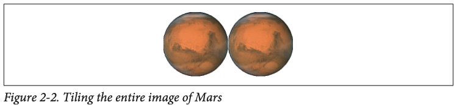

现在我们要把图片的内部区域改为平铺模式，只需把前面代码中的 `capInsets` 参数改一下（见图 2‑3）：
```swift
let marsTiled = mars.resizableImage(
    withCapInsets: UIEdgeInsets(
        top: mars.size.height / 4.0,
        left: mars.size.width  / 4.0,
        bottom: mars.size.height / 4.0,
        right: mars.size.width  / 4.0
    ),
    resizingMode: .tile
)
```

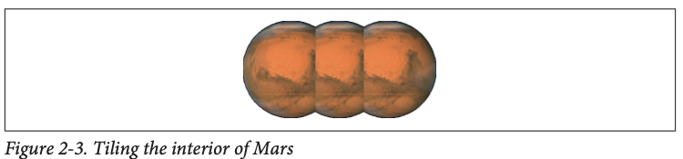

接下来我将演示图像的拉伸效果。我们首先从修改图像的 `resizingMode` 开始，不改变其他代码（见图 2-4）。
```swift
let marsTiled = mars.resizableImage(
    withCapInsets: UIEdgeInsets(
        top: mars.size.height / 4.0,
        left: mars.size.width  / 4.0,
        bottom: mars.size.height / 4.0,
        right: mars.size.width  / 4.0
    ),
    resizingMode: .stretch
)
```

一种常见的拉伸策略是将原始图像几乎一半的区域作为 `capInsets`，只在中间保留一个很小的矩形区域，让它拉伸以填充最终图像的整个内部（见图 2-5）：

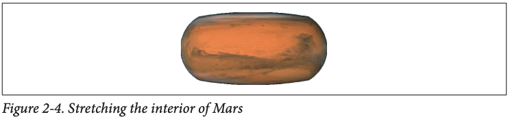

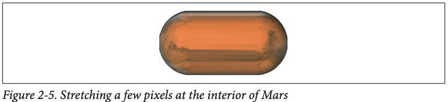

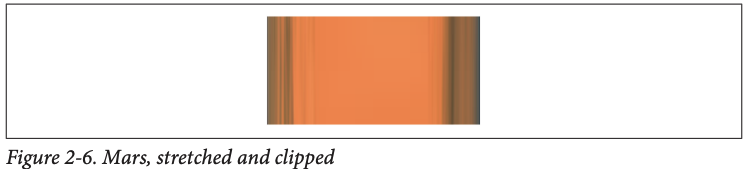

```swift
let marsTiled = mars.resizableImage(
    withCapInsets: UIEdgeInsets(
        top:    mars.size.height / 2.0 - 1,
        left:   mars.size.width  / 2.0 - 1,
        bottom: mars.size.height / 2.0 - 1,
        right:  mars.size.width  / 2.0 - 1
    ),
    resizingMode: .stretch
)
```
在上一个例子中，如果图像视图的 `contentMode` 设置为 `.scaleAspectFill`，并且 `clipsToBounds` 为 `true`，就会出现一种类似渐变的视觉效果。原因是被拉伸的图像上下部分超出了图像视图的边界，因此这些部分不会被绘制出来（见图 2-6）。

你也可以直接在资源目录中配置一张可拉伸的图像。很多情况下，一张图像在应用中主要就是作为可拉伸图使用，并且总是搭配相同的 `capInsets` 和 `resizingMode`，因此提前在资源目录中配置好这些属性会更方便，可以避免在代码中重复设置。

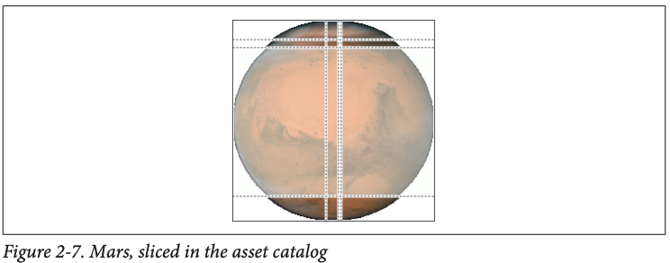

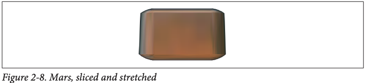

要在资源目录中将图像配置为可拉伸图像，选中该图像，然后再属性检查器的 `Slicing` 部分，将 `Slices` 弹出菜单设置为 `Horizontal`、`Vertical` 或 `Horizontal and Vertical`。这样会出现更多设置选项。你可以通过 `Center` 弹出菜单指定图像的 `resizingMode`，也可以直接输入具体数值，或者点击画布右下角的 `Show Slicing` 按钮，以图形化方式调整切片区域。

这个功能比 `resizableImage(withCapInsets:resizingMode:)` 更强大。它允许你单独指定端点区域，与可平铺或可拉伸的区域分开处理，其他部分会被切除。在图 2-7 中，左上、右上、左下、右下的深色区域会原样绘制；四条细长的带状区域会被拉伸；顶部中间的小矩形会被拉伸以填充大部分内部；而其余的中央大块——被类似纱帘覆盖的部分——则会完全省略。最终效果如图 2-8 所示。

### Transparency  Masks

在某些界面场景中，比如按钮或类似按钮的界面控件，会把一张图像当作透明蒙版（也叫作模板）来处理。这意味着图像本身的颜色值会被忽略，只有每个像素的透明度（`alpha`）起作用。最终显示在屏幕上的图像，是把这张图像的透明度与一个单一的 `tint` 颜色组合后生成的。

一张图像会被如何处理，取决于它的一个属性 —— `renderingMode`（渲染模式）。这个属性是只读的；如果你想在代码里修改它，需要先从一张图像开始，然后调用它的 `withRenderingMode(_:)` 方法，生成一个带有不同渲染模式的新图像。

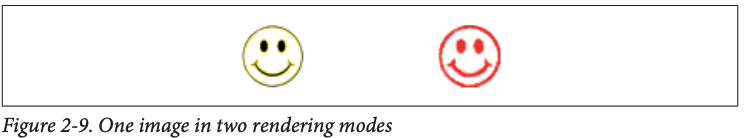

渲染模式有下面三种：
1. `.automatic`
2. `.alwaysOriginal`
3. `.alwaysTemplate`

默认的 `renderingMode` 是 `.automatic`，这表示图像通常会以正常方式绘制，除非遇到某些特定的上下文（比如按钮）需要把它当作透明蒙版来处理。使用另外两个渲染模式值时，你可以强制让图像始终正常绘制（即使在通常会当作蒙版的上下文中），或者你也可以强制让图像始终被当作透明蒙版处理（即使在通常会正常绘制的上下文中）。

为了配合这个特性，iOS 为每个 `UIView` 提供了一个 `tintColor` 属性，它会用于为其包含的模板图像（template image）着色（tint）。此外，这个 `tintColor` 默认会在视图层级中向下继承，甚至贯穿整个应用，从窗口（window）开始（见第1章）。你给应用的主窗口设置 `tintColor` 通常是对窗口进行的少数几项更改之一；否则，应用会采用系统默认的蓝色作为 `tintColor`。（另一种方式是：如果你使用的是main storyboard，可以在`File Inspector`中设置全局 `tintColor`。）每个视图都可以单独设置自己的 `tintColor`，并且这个颜色也会被它的子视图继承。图 2-9 展示了两个按钮使用同一张背景图：一个使用普通的渲染模式（original），另一个使用模板渲染模式（template），而整个应用窗口的 `tintColor` 被设置成了红色。（关于模板图像和 `tintColor` 的更多内容，将在第12章讲解。）

你可以在Asset Catalog（资源目录）中为图像设置渲染模式。选中资源目录中的图像集（`image set`），然后在 `Attributes Inspector`（属性检查器）中使用 `“Render As”` 的下拉菜单，将渲染模式设置为：

-  Default：`.automatic`
-  Original Image：`.alwaysOriginal`
-  Template Image：`.alwaysTemplate`

如果你打算主要以某种渲染模式使用这张图像，那么在资源目录中设置它是一个非常好的方式，因为这样你就不必每次在代码里获取图像时都手动设置渲染模式。只要你使用 `UIImage(named:)` 初始化这张图像，它就会自动带有你在资源目录中设置的渲染模式。

iOS 13 引入的符号图像（symbol images）本身没有颜色，因此实际上它们始终是模板图像（template images）。

同样是 iOS 13 的新特性，现在你可以直接对 `UIImage` 应用 `tintColor`调用：
* `withTintColor(_:)`
* `withTintColor(_:renderingMode:)`

这在某些场景下特别有用，比如你希望绘制一个符号图像（symbol image）或模板图像（template image），但该绘制上下文中没有继承的 `tintColor`（比如在一个图形上下文中 `draw(at:)`、`UIGraphicsImageRenderer` 等）。不过，我发现这些方法的行为有点奇怪……

如果你对一个普通图像（不是模板图像）使用 `withTintColor`，它也会被当作模板图像来处理——即使你设置了渲染模式为 `.alwaysOriginal`，它仍然可能被 `tintColor` 覆盖！

如果你对一个模板图像（比如符号图像 SF Symbols，或者你显式设置了 `.alwaysTemplate`）调用 `withTintColor(_:)`，然后把这个图像放进一个带有 `tintColor` 的视图（比如 `UIImageView`、`UIButton`），你设置的颜色会被忽略 ！

如果你想让你在 `withTintColor` 中设置的颜色真正显示出来，必须同时指定 `renderingMode: .alwaysOriginal` 。

### Reversible Images
当你的应用运行在设置为从右到左语言（如阿拉伯语、希伯来语）的系统中，并且你已经为这些语言做了本地化，整个用户界面会自动翻转（镜像布局）。不过，一般来说，这种界面翻转不会影响你的图片显示。系统默认认为：你不希望图片也被翻转 ，所以图像默认是保持原样的，不会随着界面方向自动镜像。

不过，有时候你确实希望图像在界面镜像时也一起翻转 。

比如：你设计了一个箭头图标，表示新界面将从哪个方向出现。当用户点击按钮后，推入一个新的视图控制器：
* 在从左到右（LTR）的语言环境下，新界面会从右侧滑入；
* 但在从右到左（RTL）的语言环境下，新界面是从左侧滑入 。

这种情况下，图标的方向本身具有语义意义 ，代表“前进”或“页面来源方向”。那么在 RTL 情况下，它也应该水平翻转，才符合用户直觉。

如果你希望图像在 RTL（从右到左）语言环境下自动翻转（镜像显示），你可以在代码中调用：
```swift
image.imageFlippedForRightToLeftLayoutDirection()
```

这个方法会根据当前系统的布局方向生成一张对应方向的图像 ：

* 在 LTR（左到右）系统中，会返回原始图像；
* 在 RTL（右到左）系统中，会返回一张水平翻转后的图像。

你可以将这个新图像用于界面中的组件，比如 `UIImageView`。

即使一张图像可以自动翻转，你仍然可以通过设置该视图的 `semanticContentAttribute` 来强制关闭翻转行为（比如在某些视图中始终使用原图）

你在 Asset Catalog（资源目录）中也可以设置图像是否需要在 RTL（从右到左）环境下自动镜像。

只需使用属性检查器中的  “Direction” 下拉菜单，选择对应的 “Mirrors” 选项，即可让系统自动在 RTL 环境下翻转图像。

此外，正如我在第 1 章提到的那样，布局方向（layout direction）是一种 `trait`（特征），这意味着你可以为不同方向提供两套不同的图像：一套用于 LTR，另一套用于 RTL。

设置这对图像最简单的方法，是在 asset catalog 中将 `Direction` 设置为 “Both” 。这时会出现两个图像插槽：
* 一个用于左到右（LTR）
* 一个用于右到左（RTL）

你可以把不同方向的图像分别放进去，系统会根据当前语言环境自动选用正确的那一张。如果你更偏向用代码实现，也可以使用 `UIImageAsset` 注册成对图像，这一章前面已经演示过了.

你还可以通过调用图像的 `withHorizontallyFlippedOrientation()` 方法，强制让图像水平翻转，不依赖于当前的布局方向（LTR / RTL） ，也不受语义属性（semanticContentAttribute）的影响 。

## Graphics Contexts
有时候你并不只是想把一张现成的图片直接放到界面上，而是希望通过代码自己绘制图像。这时你就需要用到图形上下文（`graphics context`）。这才是图像处理真正有趣的地方。

图形上下文可以理解为一个“画布”，你所有的绘图操作都必须在这个画布上进行。换句话说，如果没有图形上下文，你在代码里就无法画图。在 iOS 中，有多种方式可以获得图形上下文，下面介绍几种最常见的方法。
1. Cocoa creates the graphics context  
你可以通过继承 `UIView` 并重写它的 `draw(_:)` 方法来自定义绘图。当系统调用这个方法时，Cocoa 会自动创建一个图形上下文，并要求你立即在这个上下文中进行绘制。你在这里画的内容，就是这个 `UIView` 最终在屏幕上显示的内容。
2. Cocoa passes you a graphics context  
你也可以通过继承 `CALayer` 并重写它的 `draw(in:)` 方法来自定义绘图，或者为一个 `CALayer` 指定一个代理对象，并在代理中实现 `draw(_:in:)` 方法来完成绘制操作。这里的 `in:` 参数就是图形上下文。你在这个上下文中绘制的内容会显示在对应的图层上。（图层的内容将在第 3 章详细讲解。）
3. You create an image context  
前面提到的两种方式都属于“按需绘制”——你把绘图代码放在系统规定的位置（比如 `draw(_:)` 或 `draw(in:)` 中），当系统认为需要重绘时，它就会自动调用这些方法。而另一种主要的绘图方式是：你直接在代码中生成一个 `UIImage`，一次性完成绘制。这种情况下，你需要使用 `UIGraphicsImageRenderer` 来创建一个图形上下文，并在其中绘制图像内容。

此外，在程序运行的某个时刻，要么存在一个当前的图形上下文，要么就没有。
1. 当 `UIView` 的 `draw(_:)` 方法被调用时，系统已经自动将该视图的绘图上下文设置为当前的图形上下文。
2. 当 `CALayer` 的 `draw(in:)` 方法或其代理的 `draw(_:in:)` 方法被调用时，传入的 `in:` 参数虽然是一个图形上下文，但它并不是当前的图形上下文。如果你在绘图过程中需要使用“当前上下文”的方式（比如使用 `Core Graphics` 的一些函数），那就需要你自己手动将这个上下文设为当前上下文 。
3. 当你自己创建一个图像上下文，则会自动变成当前上下文。

对初学者来说，绘图最让人困惑的地方之一在于：iOS 中存在两套绘图工具，它们对“图形上下文”的使用方式截然不同。一套工具依赖于当前图形上下文的存在才能正常工作；而另一套工具则 只需要你显式提供一个上下文 ，并不关心当前上下文的状态。
1. UIKit  
Cocoa 中有许多类本身就具备绘图能力，比如 `UIImage`、`NSString`（用于绘制文本）、`UIBezierPath`（用于绘制路径和图形）、`UIColor` 等。这些类中有些提供了简单易用的绘图方法，适合快速上手；而有些则功能强大，可以满足复杂的绘图需求。在大多数情况下，UIKit 提供的这些工具已经足够应对日常的绘图任务。
使用 UIKit 进行绘图时，你只能在当前图形上下文中作画。如果当前已经存在一个上下文（比如在 `UIView` 的 `draw(_:)` 方法中），你就可以直接绘图，不需要额外处理。但如果是在 `CALayer` 的绘图方法中，你会收到一个传入的上下文参数，而它并不是当前上下文。如果你还想使用 UIKit 提供的便利绘图方法（比如 `UIColor`、`UIImage` 等），你就需要手动将这个上下文推入为当前上下文，使用 `UIGraphicsPushContext(_:)`。绘图结束后，记得使用 `UIGraphicsPopContext()` 恢复原来的上下文，避免影响其他绘图操作。
2. Core Graphics  
这就是完整的绘图 API：Core Graphics ，也被称为 `Quartz` 或 `Quartz 2D`。它是 iOS 上所有绘图功能的底层系统，UIKit 的绘图功能就是构建在它之上的。Core Graphics 是一个底层绘图框架，由大量的 C 函数组成（不过在 Swift 中，这些函数通常经过了重命名，看起来更像是方法调用）。它的 API 非常丰富也较为繁琐。本章将带你了解 Core Graphics 的基础知识；如果你想深入掌握全部内容，可以查阅 Apple 的官方文档—— Quartz 2D Programming Guide。这是理解 iOS 绘图机制的权威资料。
使用 Core Graphics 进行绘图时，你必须显式指定一个图形上下文（`CGContext`） ，所有的绘图操作都必须明确告诉系统要画到哪个上下文中。在 `CALayer` 的绘图方法中，系统会通过参数把上下文直接传给你，你只需要使用这个传入的 `CGContext` 来绘制即可。但如果你是在像 `UIView.draw(_:)` 这样的环境下绘图，此时虽然已经存在一个“当前图形上下文”，你却无法直接访问它 ，除非你调用 `UIGraphicsGetCurrentContext()` 来获取这个当前上下文的引用。这个函数就是你和当前上下文之间的桥梁。

你并不需要在绘图时二选一地使用 UIKit 或 Core Graphics。实际上，你完全可以在同一段代码中混合使用这两者，共同作用于同一个图形上下文。它们只是提供了两种不同的方式，用来告诉图形上下文该如何绘制内容而已。也就是说，UIKit 和 Core Graphics 并不冲突，反而可以相辅相成、灵活配合。

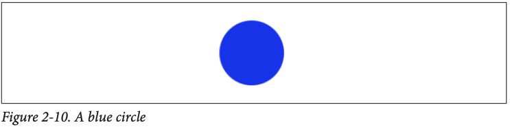

我们手上有两套绘图工具（UIKit 和 Core Graphics），再加上三种获取图形上下文的方式，组合起来就有六种绘图方法。接下来，我会用一个简单的例子——画一个蓝色圆形（如图 2-10）——来演示这六种方式的使用。此时你不需要太关注具体的绘图命令本身，而是要留意两个重点： 图形上下文是如何提供的，以及我们使用的是 UIKit 还是 Core Graphics。这将帮助你理清各种绘图方式的核心差异。

### Drawing on Demand
有四种按需绘制的方式，下面先介绍其中的第一种：实现 UIView 子类的 `draw(_: )` 方法，使用 UIKit 在 Cocoa 已经为我们准备好的当前图形上下文中进行绘制：
```swift
override func draw(_ rect: CGRect) {
    let p = UIBezierPath(ovalIn: CGRect(0,0,100,100))
    UIColor.blue.setFill()
    p.fill()
}
```
现在我将使用 Core Graphics 来实现同样的功能，需要先获取当前的图形上下文引用：
```swift
override func draw(_ rect: CGRect) {
    let con = UIGraphicsGetCurrentContext()!
    con.addEllipse(in:CGRect(0,0,100,100))
    con.setFillColor(UIColor.blue.cgColor)
    con.fillPath()
}
```
接下来，我要实现 CALayer 代理的 `draw(_:in:)` 方法。这种情况下系统会把一个 CGContext 的引用传给我，但它并不是当前图形上下文。为了使用 UIKit 绘制，我必须先把它设为当前上下文，并在完成绘制后记得恢复原先的上下文。
```swift
override func draw(_ layer: CALayer, in con: CGContext) {
    UIGraphicsPushContext(con)
    let p = UIBezierPath(ovalIn: CGRect(0,0,100,100))
    UIColor.blue.setFill()
    p.fill()
    UIGraphicsPopContext()
}
```
在 CALayer 代理的 draw(_:in:) 方法中使用 Core Graphics 时，我只需直接使用系统传入的那个上下文即可：
```swift
override func draw(_ layer: CALayer, in con: CGContext) {
    con.addEllipse(in:CGRect(0,0,100,100))
    con.setFillColor(UIColor.blue.cgColor)
    con.fillPath()
}
```

### Drawing a UIImage
下面我演示如何创建一个蓝色圆形的 UIImage。这个操作可以随时进行（无需等待特定方法被调用），也可以在任何类中完成（不用非得是在 UIView 子类里）。

在代码中生成 UIImage 时，可以使用 UIGraphicsImageRenderer。基本做法是先创建一个渲染器实例，然后调用它的 image 方法，并在传入的闭包中编写绘图指令，最终由 image 方法返回生成的 UIImage。

我将在这个例子中使用 UIKit 来进行绘制：
```swift
let r = UIGraphicsImageRenderer(size:CGSize(100,100))
let im = r.image { _ in
    let p = UIBezierPath(ovalIn: CGRect(0,0,100,100))
    UIColor.blue.setFill()
    p.fill()
}
// im is the blue circle image, do something with it here ...
```
使用 Core Graphics 来进行绘制：
```swift
let r = UIGraphicsImageRenderer(size:CGSize(100,100))
let im = r.image { _ in
    let con = UIGraphicsGetCurrentContext()!
    con.addEllipse(in:CGRect(0,0,100,100))
    con.setFillColor(UIColor.blue.cgColor)
    con.fillPath()
}
// im is the blue circle image, do something with it here ...
```
在这些示例中，我们调用了 `UIGraphicsImageRenderer` 的 `init(size:)` 并使用了它的默认配置，这通常就能满足需求。如果想要进一步自定义图像上下文，可以先调用 `UIGraphicsImageRendererFormat` 的 `default` 类方法获取默认格式，通过该格式的各项属性进行配置，然后将其传给 `UIGraphicsImageRenderer` 的 `init(size:format:)`。这些属性包括：
1. `opaque`  
默认情况下，这个属性为 `false`，表示图像上下文是透明的。如果将其设为 `true`，图像上下文就会变为不透明并带有黑色背景，生成的图像也不会包含任何透明度。
2. `scale`  
默认情况下，这个值与主屏幕的缩放比例相同，即 `UIScreen.main.scale`。这意味着生成的图像分辨率会与当前设备匹配。
3. `preferredRange`  
   色域可从 `UIGraphicsImageRendererFormat.Range` 中选择：  
   * `.standard`  
   * `.extended`  
   * `.automatic` （如果在支持“广色域”的设备上运行，则与 `.extended` 相同）

`UIGraphicsImageRenderer` 的 `image` 方法会传入一个参数：`UIGraphicsImageRendererContext`。通过这个上下文，你可以访问初始化时使用的 `UIGraphicsImageRendererFormat`（format 属性），也可以通过它的 `cgContext` 属性获取当前的 `Core Graphics` 上下文（当然也可以直接调用 `UIGraphicsGetCurrentContext` 来获取，以保持与其他绘制方式的一致性）。此外，`UIGraphicsImageRendererContext` 还提供了 `currentImage` 属性，可以在绘制过程中随时拿到当前已经渲染出的图像快照；它自身也实现了一些基本的绘图命令。

## UIImage Drawing
`UIImage` 提供了一些方法，可以将自身绘制到当前图形上下文中。我们之前已经学过如何获取一张 `UIImage`，也了解了如何获取并设置当前的图形上下文，所以现在我们已经具备了使用这些绘图方法的基础条件，可以开始尝试让图像“自己画自己”到画布上了。

下面我们来创建一张新的 `UIImage`，图像内容是两个火星的图片并排放置在一起（如图 2-11 所示）。这个例子将展示如何在图形上下文中绘制多个图像，从而生成一张合成图。
```swift
let mars = UIImage(named: "Mars")!
let sz = mars.size

let r = UIGraphicsImageRenderer(
    size: CGSize(width: sz.width * 2, height: sz.height),
    format: mars.imageRendererFormat
)

let im = r.image { _ in
    mars.draw(at: CGPoint(x: 0, y: 0))
    mars.draw(at: CGPoint(x: sz.width, y: 0))
}
```

可以看到，在这个例子中图像的缩放处理得非常好。如果原始的火星图片在资源中包含了多个分辨率版本（例如 @1x、@2x、@3x），系统会自动选用最适合当前设备分辨率的那一张图像，并为它分配正确的 `scale` 值。同时，我们绘制图像所使用的图形上下文本身也会默认采用合适的缩放比例。最终生成的合成图像 `im` 同样具备正确的 `scale` 值。

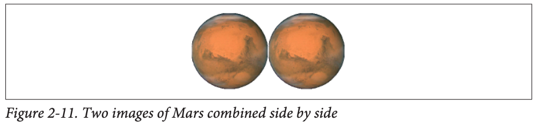

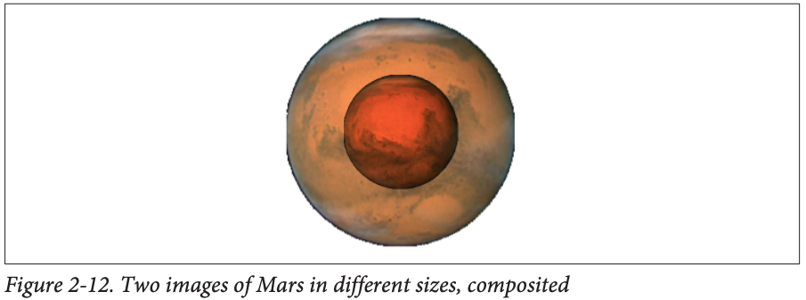

这意味着：不管设备屏幕分辨率是多少，我们的代码生成的图像在视觉上都会正确呈现，保持清晰且尺寸合理，无需我们做额外处理。系统的图像缩放机制在背后已经帮我们完成了适配。

> 如果你创建图形上下文的目的是为了将一张已有的 `UIImage` 绘制进去，那么你可以通过一个优化手段提升效率：在创建 `UIGraphicsImageRenderer` 时，使用原始图像的 `imageRendererFormat` 来初始化渲染器的格式 。这样可以确保新建的图形上下文在尺寸、缩放比例、颜色空间等方面与原图完全一致，避免不必要的转换开销，提高性能和渲染质量。

`UIImage` 还提供了一些绘图方法，可以让你在绘制时将图像缩放到指定的矩形区域，相当于在绘制过程中对图像进行了尺寸调整。同时，你还可以指定图像的混合模式（compositing / blend mode），也就是图像与背景内容如何叠加。为了演示这些功能，接下来我们将创建这样一张图：中间是一张火星图像，它叠加在另一张尺寸是它两倍的火星图上，并使用 `.multiply` 混合模式进行叠加（如图 2-12 所示）。这个例子可以帮助你理解图像缩放与混合模式在合成图像中的实际应用。
```swift
let mars = UIImage(named: "Mars")!
let sz = mars.size

let r = UIGraphicsImageRenderer(
    size: CGSize(width: sz.width * 2, height: sz.height * 2),
    format: mars.imageRendererFormat
)

let im = r.image { _ in
    mars.draw(in: CGRect(x: 0, y: 0, width: sz.width * 2, height: sz.height * 2))
    mars.draw(
        in: CGRect(
            x: sz.width / 2.0,
            y: sz.height / 2.0,
            width: sz.width,
            height: sz.height
        ),
        blendMode: .multiply,
        alpha: 1.0
    )
}
```

在 iOS 开发中，将一张图像重新绘制为较小尺寸是非常重要的优化手段。因为如果你把一张很大的图片交给 `UIImageView`，却让它显示得很小，这会浪费宝贵的内存资源。虽然某些框架（例如第 22 章的 Image I/O 和第 17 章的 PhotoKit）支持直接加载缩略图，但在某些情况下，你仍然需要自己将图像按指定尺寸进行缩放，以适配你的界面。书中在附录 B 提供了一个通用的工具方法，用于将 `UIImage` 缩放到一个指定的 `CGSize` 中，这是非常实用的技巧，适合在项目中重复使用。

有时候，你可能希望从原始图片中截取一小块区域，也就是在绘制时进行裁剪。可惜的是，`UIImage` 并没有提供可以指定源区域的绘图方法。不过你可以通过一种变通方式来实现这个目的：创建一个较小的图形上下文，并调整图片的绘制位置，让你想保留的那部分内容正好落在这个上下文范围内。这样做没有任何问题，也是一种很常见的处理方式——上下文之外的部分不会被绘制出来。

如果你想得到火星图片的右半部分，可以创建一个宽度为原图一半的图形上下文，然后将整张火星图向左平移，使得它的右半部分正好落在这个图形上下文中（左半部分则被裁掉）。这样就能得到火星的右半边图像了（见图 2-13）：
```swift
let mars = UIImage(named: "Mars")!
let sz = mars.size

let r = UIGraphicsImageRenderer(
    size: CGSize(width: sz.width / 2.0, height: sz.height),
    format: mars.imageRendererFormat
)

let im = r.image { _ in
    mars.draw(at: CGPoint(x: -sz.width / 2.0, y: 0))
}
```

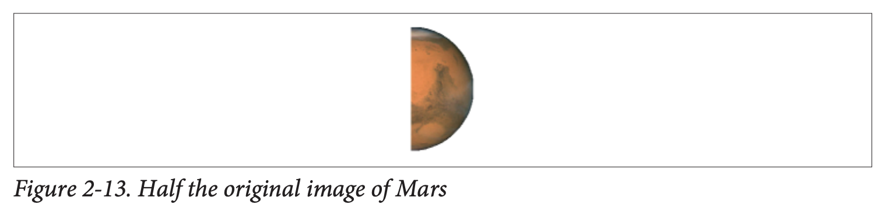

`UIGraphicsImageRenderer` 有一个很方便的特性：它不仅可以用尺寸（size）来初始化，也可以直接使用边界（bounds）。这样一来，我们不必再将火星图像向左平移来裁剪右半部分，而是可以把火星图像从原点（.zero）开始绘制，只需将绘图的 bounds 向右偏移，就能达到同样的裁剪效果。
```swift
let mars = UIImage(named: "Mars")!
let sz = mars.size

let r = UIGraphicsImageRenderer(
    bounds: CGRect(
        x: sz.width / 2.0,
        y: 0,
        width: sz.width / 2.0,
        height: sz.height
    ),
    format: mars.imageRendererFormat
)

let im = r.image { _ in
    mars.draw(at: .zero)
}
```

矢量图像的使用方式和普通图像一样。如果你在资源目录中添加的是 PDF 格式的矢量图，并勾选了“保留矢量数据”（Preserve Vector Data），那么在调用 `draw(in:)` 方法绘制时，它会保持清晰缩放。而符号图像（Symbol Image）本身就是矢量的，无论如何缩放，也总是保持清晰。
```swift
let symbol = UIImage(systemName:"rhombus")!
let sz = CGSize(100,100)
let r = UIGraphicsImageRenderer(size:sz)
let im = r.image { _ in
    symbol.withTintColor(.purple).draw(in:CGRect(origin:.zero, size:sz))
}
```
最终绘制出来的菱形是紫色的（因为我们在绘制前给图像设置了 `tint` 颜色），并且在 100×100 的尺寸下显示得很平滑（因为它本身是矢量图）。但需要注意的是，一旦你把这个矢量图绘制成了一个 UIImage（比如这里的 `im`），它就变成了普通的位图图像，不再具备矢量图那种无损缩放的特性了。

不过，最好不要像我刚才那样做。对于符号图像（symbol image），你应尽量避免直接调用 `draw(in:)`。更推荐的做法是：先通过自定义的符号配置（symbol configuration）生成一个 `UIImage`，指定所需的 point size，然后再用 `draw(at:)` 方法绘制。这样，符号图像会根据你提供的点大小自动调整自身尺寸，效果更好也更规范。

## CGImage Drawing
Core Graphics 中对应 `UIImage` 的类型是 `CGImage`。从本质上讲，UIImage 通常是对 `CGImage` 的封装：`UIImage` 包含位图图像数据，以及缩放比例、图像方向等附加信息，而 `CGImage` 只包含原始的位图图像数据。两者之间可以轻松互相转换：UIImage 有一个 `cgImage` 属性可以访问其底层的 `Quartz` 图像数据，而你也可以通过 `init(cgImage:)` 或 `init(cgImage:scale:orientation:)` 方法，用 CGImage 创建一个 `UIImage`。

`CGImage` 允许你从原始图像中裁剪出一个矩形区域来创建新图像，这是 `UIImage` 无法直接做到的。（`CGImage` 还有其他 `UIImage` 不具备的能力，比如你可以对 `CGImage` 应用图像遮罩。）下面我将通过一个例子来演示这个功能：把火星的图片一分为二，并分别绘制这两个部分（见图 2-14）。
```swift
let mars = UIImage(named: "Mars")!
// extract each half as CGImage
let marsCG = mars.cgImage!
let sz = mars.size

let marsLeft = marsCG.cropping(
    to: CGRect(
        x: 0,
        y: 0,
        width: sz.width / 2.0,
        height: sz.height
    )
)!
let marsRight = marsCG.cropping(
    to: CGRect(
        x: sz.width / 2.0,
        y: 0,
        width: sz.width / 2.0,
        height: sz.height
    )
)!

let r = UIGraphicsImageRenderer(
    size: CGSize(width: sz.width * 1.5, height: sz.height),
    format: mars.imageRendererFormat
)

let im = r.image { ctx in
    let con = ctx.cgContext
    con.draw(
        marsLeft,
        in: CGRect(
            x: 0,
            y: 0,
            width: sz.width / 2.0,
            height: sz.height
        )
    )
    con.draw(
        marsRight,
        in: CGRect(
            x: sz.width,
            y: 0,
            width: sz.width / 2.0,
            height: sz.height
        )
    )
}
```

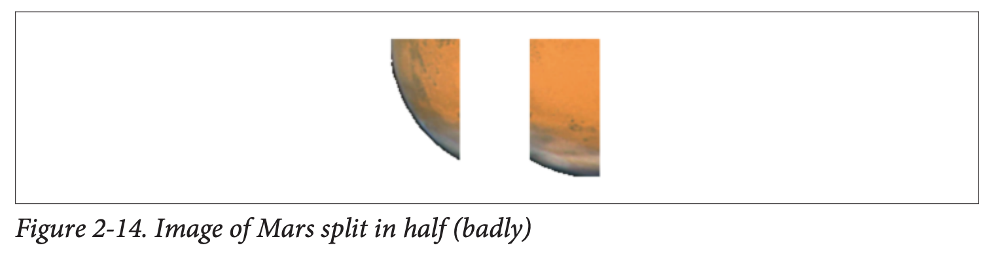

好吧，这简直是一场灾难！首先，图像被绘制成了上下颠倒的状态。它并不是旋转了，而是上下翻转了——用专业术语来说，就是“翻转”（flipped）。这种情况常见于你在创建 `CGImage` 后再去绘制它的时候，原因在于原始图像和目标绘图上下文之间的坐标系统不一致所导致的。

其次，我们并没有把火星的图像分成两半，结果好像变成了四分之一。这是因为我们使用的是高分辨率设备，而系统加载的是图像文件的高分辨率版本。当我们使用 `UIImage` 的 `init(named:)` 方法加载图像时，系统会根据图像的实际分辨率自动设置 UIImage 的 `scale` 属性，从而补偿尺寸的放大。但 `CGImage` 并没有 `scale` 这个概念，它对图像分辨率的放大一无所知。因此，当我们从 `UIImage` 中提取出 `CGImage`（比如 `mars.cgImage`）时，这个 `CGImage` 的尺寸实际上比 `mars.size` 所表示的尺寸要大。结果，我们后续的裁剪和计算全都基于错误的尺寸，最终导致裁剪的位置完全不对。

当你进入 `CGImage` 的层级去处理图像时，最简单的解决方案就是：将最终得到的 `CGImage` 再包裹回一个 `UIImage`，然后使用这个 `UIImage` 来绘制，而不是直接绘制 `CGImage`。这样你就可以通过 `init(cgImage:scale:orientation:)` 方法创建 `UIImage`，同时手动设置合适的缩放比例（`scale`），从而补偿高分辨率图像带来的尺寸差异。更重要的是，使用 `UIImage` 来绘图还能避免上下翻转的问题。
```swift
let mars = UIImage(named: "Mars")!
let sz = mars.size
let marsCG = mars.cgImage!
let szCG = CGSize(width: CGFloat(marsCG.width), height: CGFloat(marsCG.height))

let marsLeft = marsCG.cropping(
    to: CGRect(
        x: 0,
        y: 0,
        width: szCG.width / 2.0,
        height: szCG.height
    )
)

let marsRight = marsCG.cropping(
    to: CGRect(
        x: szCG.width / 2.0,
        y: 0,
        width: szCG.width / 2.0,
        height: szCG.height
    )
)

let r = UIGraphicsImageRenderer(
    size: CGSize(width: sz.width * 1.5, height: sz.height),
    format: mars.imageRendererFormat
)

let im = r.image { _ in
    UIImage(
        cgImage: marsLeft!,
        scale: mars.scale,
        orientation: mars.imageOrientation
    ).draw(at: CGPoint(x: 0, y: 0))
    UIImage(
        cgImage: marsRight!,
        scale: mars.scale,
        orientation: mars.imageOrientation
    ).draw(at: CGPoint(x: sz.width, y: 0))
}
```

## Snapshots
一个完整的视图——无论是一个按钮，还是整个界面（包括它内部的所有子视图）——都可以通过调用 UIView 的实例方法 `drawHierarchy(in:afterScreenUpdates:)` 被绘制到当前的图形上下文中。这样会生成一个原视图的快照：它在外观上和原视图一样，但其实只是一个位图图像，是一个轻量级的视觉副本。

> `drawHierarchy(in:afterScreenUpdates:)` 的执行速度远远快于 CALayer 的 `render(in:)` 方法；不过 `render(in:)` 依然有它的用武之地，我会在第 5 章中展示它的实际用途。

获取视图快照还有一种速度更快的方法，就是使用 `UIView`（或 `UIScreen`）提供的 `snapshotView(afterScreenUpdates:)` 方法。这个方法返回的不是 `UIImage`，而是一个 `UIView`；它类似于一个只会显示单张图片的 `UIImageView`，这张图片就是视图的快照。通常情况下，你可以直接使用这个快照视图。如果你放大它的 `bounds`，快照图像也会随之拉伸。如果你希望这种拉伸效果像可缩放图片那样具有弹性和边距控制，可以使用 `resizableSnapshotView(from:afterScreenUpdates:withCapInsets:)` 方法。另外，从一个快照视图再生成一个快照视图，也是完全合理且可行的。

快照之所以有用，是因为 iOS 界面具有高度的动态特性。你可以把某个视图的快照放到界面上，盖在真实视图的前面，用来隐藏真实视图正在发生的变化；或者在动画过程中使用快照，制造出视图在移动的错觉，其实动的只是这张快照而已。

下面是我一个应用中的实际例子。这是一个纸牌游戏，界面上的视图代表的是一张张卡牌。我想做一个动画效果，把所有卡牌从牌桌上飞出去，飞向屏幕外的某个位置。但我并不想真的去移动这些视图本身，因为它们还要继续用来显示之后的新卡牌。所以我对每张卡牌视图生成一个快照视图，把原视图隐藏掉，然后把快照放在原来的位置，再对这些快照执行飞出的动画。这段代码在你读完第 4 章之后会更容易理解，但这个思路已经很清楚了。
```swift
for v in views {
    let snapshot = v.snapshotView(afterScreenUpdates: false)!
    let snap = MySnapBehavior(
        item: snapshot,
        snapto: CGPoint(
            x: self.anim.referenceView!.bounds.midX,
            y: -self.anim.referenceView!.bounds.height
        )
    )
    self.snaps.append(snapshot) // keep a list so we can remove them later
    snapshot.frame = v.frame
    v.isHidden = true
    self.anim.referenceView!.addSubview(snapshot)
    self.anim.addBehavior(snap)
}
```

## CIFilter and CIImage
`CIFilter` 和 `CIImage` 中的 “CI” 代表的是 `Core Image`，它是一套通过数学滤镜对图像进行处理的技术。`Core Image` 最早是应用在 macOS 桌面系统上的，后来在 iOS 5 中被引入移动平台。当时，有些桌面系统支持的滤镜没有被移植到 iOS，可能是因为那些滤镜在计算上对移动设备来说太过复杂。随着时间推移，越来越多 macOS 上的滤镜被添加进了 iOS，现在两者已经完全一致：macOS 上的所有滤镜在 iOS 上也都可以使用，两套系统的 API 几乎是一样的。

滤镜在 Core Image 中就是一个 `CIFilter`。可用的滤镜有 200 多种，按照功能大致可以分成几个主要的类别：
1. 图案和渐变类滤镜  
这类滤镜用于生成 `CIImage`，可作为图像素材与其他 `CIImage` 进行合成。生成的内容包括单一颜色、棋盘格、条纹、渐变色等。
2. 合成类滤镜  
这类滤镜将一张图像与另一张图像进行合成，使用的合成方式类似于图像处理软件中常见的混合模式（blend modes），比如叠加、正片叠底、屏幕等。
3. 颜色类滤镜  
这类滤镜用于调整或修改图像的颜色属性。你可以改变图像的饱和度、色相、亮度、对比度、伽马值、白点、曝光度、阴影和高光等。
4. 几何类滤镜  
这类滤镜对图像进行基本的几何变换，例如缩放、旋转、裁剪等操作。
5. 变形类滤镜
这类滤镜用于对图像进行扭曲、模糊或风格化处理。
6. 过渡类滤镜  
这类滤镜用于在两张图像之间生成过渡帧。通过按顺序请求多个帧，你可以实现图像之间的动画过渡（我会在第 4 章中进行演示）。
7. 特殊用途类滤镜  
这类滤镜执行一些特定功能的操作，比如人脸识别、条形码或二维码的生成等。

`CIFilter` 本质上是一组用于生成 `CIImage` 的指令——也就是滤镜的输出图像。而大多数 `CIFilter` 又需要一个 `CIImage` 作为输入图像。因此，一个滤镜的输出图像可以作为另一个滤镜的输入，这样就能把多个滤镜串联起来。在你构建滤镜链的过程中，实际上图像处理并没有立即发生——你只是在配置一组处理步骤的执行顺序。

如果滤镜链中的第一个 `CIFilter` 需要一个输入图像，你可以通过 `init(cgImage:)` 从 `CGImage` 创建一个 `CIImage`，或者通过 `init(image:)` 从 `UIImage` 创建。当最后一个 `CIFilter` 生成一个 `CIImage` 后，你可以将它转换为位图图像（`CGImage` 或 `UIImage`）。也就是说，整个图像处理过程是通过 `CIImage` 和 `CIFilter` 作为中间步骤，最终把一张图变成了另一张图。最后这一步，把 `CIImage` 转换成实际的位图图像，叫做“渲染”（rendering）。图像的所有处理计算，只有在渲染时才真正执行。也就是说，只有在渲染最后那个 `CIImage` 的时候，才会进行一次真正消耗性能的图像处理运算。

> 初学者常犯的一个错误，是试图通过 `UIImage` 的 `ciImage` 属性直接获取 `CIImage`。通常这种做法是行不通的。这个属性并不会把 `UIImage` 转换成 `CIImage`，它只在 `UIImage` 本身就是基于 `CIImage` 创建的情况下才有值。而大多数 `UIImage` 实际上是包装了 `CGImage` 的，因此它们的 `CIImage` 属性通常是 `nil`。

CIFilter 的基本用法其实很简单：
1. 首先，你需要获取一个 `CIFilter` 对象。可以通过滤镜的字符串名称使用 `init(name:)` 来创建。想了解有哪些可用的滤镜名称，可以查阅 Apple 的 Core Image Filter Reference 文档，或者调用 `CIFilter` 的类方法 `filterNames(inCategories:)`，传入 `nil` 来获取所有滤镜名称。从 iOS 13 开始，Apple 还提供了一种更方便的方式：你可以直接调用 CIFilter 的快捷类方法，这些方法的名称就对应于滤镜的字符串名称。
```swift
let filter = CIFilter(name: "CICheckerboardGenerator")!
// or, new in iOS 13:
let filter = CIFilter.checkerboardGenerator()
```
2. 每个滤镜都有一组键值对参数，用来控制它的具体行为。这些参数就是滤镜的可调选项。你可以根据需要设置这些参数。虽然你完全可以通过代码来查看滤镜有哪些参数，但通常还是建议参考官方文档来了解。设置参数的方法是调用 `setValue(_:forKey:)`。从 iOS 13 开始，`CIFilter` 还提供了更方便的方式，你可以直接通过属性来设置参数，无需使用字符串 key。
```swift
filter.setValue(30, forKey: "inputWidth")
// or, new in iOS 13:
filter.width = 30
```

以上这些步骤还有一些变体：
* 你不必反复调用 `setValue(_:forKey:)` 来设置每个参数，也可以使用 `setValuesForKeys(_:)` 方法一次性传入一个字典，同时设置多个参数。
* 你也可以不先创建滤镜再单独设置参数，而是通过 `init(name:withInputParameters:)` 方法一步完成创建滤镜并设置参数的操作。
* 如果某个 `CIFilter` 需要一个输入的 `CIImage`，你可以直接在 `CIImage` 上调用 `applyingFilter(_:parameters:)` 方法，一步完成滤镜的创建、参数设置以及获取输出图像的过程。

现在我们来说说如何渲染 `CIImage`。正如前面提到的，这一步才是真正进行图像处理计算的环节，可能会比较耗时、消耗性能。渲染 `CIImage` 主要有三种方式：
1. 使用 `CIContext`  
通过调用 `init()` 或 `init(options:)` 来创建一个 `CIContext`；这本身开销较大，所以应尽量只创建一个 `CIContext` 并复用它。然后调用这个 `CIContext` 的 `createCGImage(_:from:)` 方法。第一个参数是要渲染的 `CIImage`，第二个参数是一个 `CGRect`，用来指定要渲染的 `CIImage` 区域。`CIImage` 本身没有 `frame` 或 `bounds`，它的 `CGRect` 被称作 `extent`。该方法会输出一个 `CGImage`。
2. 使用 `UIImage`  
可以通过调用 `init(ciImage:)` 或 `init(ciImage:scale:orientation:)` 来创建一个包装 `CIImage` 的 `UIImage`，然后将该 `UIImage` 绘制到某个图形上下文中，正是这一步绘制操作触发了图像的渲染。
3. 使用 `UIImageView`  
这是一种比前面方法更简便的做法：先将 `CIImage` 包装成 `UIImage`，然后直接赋给 `UIImageView` 的 `image` 属性，图像视图在显示时就会自动触发渲染。通常这种方式只有在真机上才能正常工作，但在 Xcode 11 的模拟器中也有可能可用。

> 还有一些渲染 `CIImage` 的方法，它们速度更快，非常适合动画或快速渲染。特别是可以使用 `Metal`，不过这超出了本书的讨论范围。

现在我们可以开始一个示例了！我会先选用一张普通的个人照片（虽然我戴着摩托车头盔，但仍然是一张普通照片），然后制作一个圆形的暗角效果（见图 2-15）。我将利用 iOS 13 提供的新便捷方法和属性；要使用这些功能，需要导入 `CoreImage.CIFilterBuiltins`：

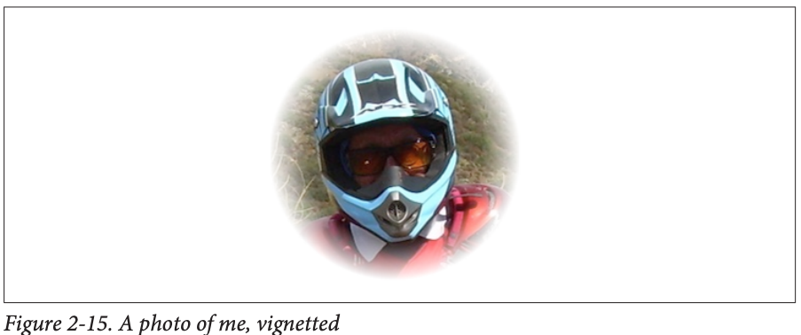

```swift
let moi = UIImage(named:"Moi")! ①
let moici = CIImage(image:moi)!
let moiextent = moici.extent
let smaller = min(moiextent.width, moiextent.height)
let larger = max(moiextent.width, moiextent.height)
// first filter
let grad = CIFilter.radialGradient() ②
grad.center = moiextent.center
grad.radius0 = Float(smaller)/2.0 * 0.7
grad.radius1 = Float(larger)/2.0
let gradimage = grad.outputImage!
// second filter
let blend = CIFilter.blendWithMask() ③
blend.inputImage = moici
blend.maskImage = gradimage
let blendimage = blend.outputImage!
```

① 我们先从我的照片（moi）创建一个 `CIImage`（命名为 moici）。  
② 在这一步，我们使用名为 grad 的 `CIFilter`，在默认的白色和黑色之间生成一个径向渐变。  
③ 然后我们使用第二个 `CIFilter（blend）`，把径向渐变当作蒙版，在我的照片和默认的透明背景之间混合。在渐变为白色的区域（渐变内半径范围内），只显示照片；在渐变为黑色的区域（渐变外半径范围外），只显示透明背景；在两者之间的区域，会出现渐变过渡，让照片在圆环区域中逐渐淡出。  

此时我们已经获得了滤镜链中的最终 `CIImage（blendimage）`，处理器还没有进行任何渲染。接下来，我们要生成最终的位图并将其显示出来。假设我们要把它设置为 `UIImageView` 实例 `self.iv` 的 `image`，就有以下两种做法:

第一种方法是使用 `CIContext`。`self.context` 是一个属性，它在初始化时就被赋值为一个 `CIContext` 对象。带星号的那一行才是真正执行渲染的代码：
```swift
let moicg = self.context.createCGImage(blendimage, from: moiextent)! // *
self.iv.image = UIImage(cgImage: moicg)
```

第二种方法是通过 `UIImage` 绘制；带星号的那一行就是实际执行渲染的那行代码：
```swift
let r = UIGraphicsImageRenderer(size:moiextent.size)
self.iv.image = r.image { _ in
    UIImage(ciImage: blendimage).draw(in:moiextent) // *
}
```
可以通过对子类化 `CIFilter`，把一系列滤镜链封装成一个自定义滤镜。你的子类只需要重写 `outputImage` 属性（以及可能的 `setDefaults` 等方法），并为每个输入键添加对应属性以支持键值编码。下面示例了一个简单的暗角滤镜 `CIFilter` 子类，它包含两个输入键：`inputImage` 用来指定要进行暗角处理的图像，`inputPercentage` 则在 0 到 1 之间，用于调整径向渐变的内半径：
```swift
class MyVignetteFilter : CIFilter {
    @objc var inputImage : CIImage?
    @objc var inputPercentage : NSNumber? = 1.0
    override var outputImage : CIImage? {
        return self.makeOutputImage()
    }
    private func makeOutputImage () -> CIImage? {
        guard let inputImage = self.inputImage else {return nil}
        guard let inputPercentage = self.inputPercentage else {return nil}
        let extent = inputImage.extent
        let smaller = min(extent.width, extent.height)
        let larger = max(extent.width, extent.height)
        let grad = CIFilter.radialGradient()
        grad.center = extent.center
        grad.radius0 = Float(smaller)/2.0 * inputPercentage.floatValue
        grad.radius1 = Float(larger)/2.0
        let gradimage = grad.outputImage!
        let blend = CIFilter.blendWithMask()
        blend.inputImage = self.inputImage
        blend.maskImage = gradimage
        return blend.outputImage
    }
}
```
下面是如何使用我们的 `CIFilter` 子类，并将其输出显示在 `UIImageView` 中：
```swift
let vig = MyVignetteFilter()
let moici = CIImage(image: UIImage(named:"Moi")!)!
vig.setValuesForKeys([
    "inputImage":moici,
    "inputPercentage":0.7
])
let outim = vig.outputImage!
let outimcg = self.context.createCGImage(outim, from: outim.extent)!
self.iv.image = UIImage(cgImage: outimcg)
```
`CIImage` 本身就是一个功能强大的类，提供了许多便捷方法。你可以对 `CIImage` 应用几何变换、裁剪图像，甚至直接对其进行高斯模糊处理。此外，`CIImage` 能够识别 `EXIF` 中的方向信息，并据此自动调整自身方向。

## Blur and Vibrancy Views
iOS 上的某些视图（比如导航栏和控制中心）是半透明的，可以模糊地呈现它们背后的内容。你可以使用 `UIVisualEffectView` 类来实现类似的效果。

`UIVisualEffectView` 通过调用 `init(effect:)` 来初始化，其中的参数是一个 `UIVisualEffect`。`UIVisualEffect` 是一个抽象基类，具体实现类有 `UIBlurEffect`（模糊效果）和 `UIVibrancyEffect`（鲜明效果）。通常你会使用带有模糊效果的视觉效果视图来模糊其背后的内容；然后如果需要，还可以添加一个带有鲜明效果的视觉效果视图及其子视图。具体来说，`UIVibrancyEffect` 创建的视图需要作为子视图放到模糊效果视图的 `contentView` 中，而任何需要应用鲜明效果的视图都要再放到鲜明效果视图自身的 `contentView` 里。这些子视图会被系统当作模板使用，也就是说，它们的原始颜色将被忽略，只有不透明度或透明度才会对显示产生影响。特别注意一点，千万不要直接将子视图添加到 `UIVisualEffectView` 本身，而应该始终添加到其 `contentView` 中。

通过调用 `init(style:)` 方法初始化 `UIBlurEffect`。在 iOS 13 中，引入了对浅色和深色界面自适应的 “materials” 样式，共有五种基础材质：
`systemUltraThinMaterial`、`systemThinMaterial`、`systemMaterial`、`systemThickMaterial` 和 `systemChromeMaterial`。此外，每种基础材质都有两个非自适应的变体，名称后分别加上 `Light` 或 `Dark`（如 `systemUltraThinMaterialLight`、`systemUltraThinMaterialDark` 等）。
* `.systemUltraThinMaterial`
* `.systemThinMaterial`
* `.systemMaterial`
* `.systemThickMaterial`
* `.systemChromeMaterial`

要初始化 `UIVibrancyEffect`，可以调用 `init(blurEffect:style:)`（iOS 13 新增）。第一个参数是底层 `UIVisualEffectView` 所使用的模糊效果；第二个参数 `style` 可以是以下几种之一：
* `.label`
* `.secondaryLabel`
* `.tertiaryLabel`
* `.quaternaryLabel`
* `.fill`
* `.secondaryFill`
* `.tertiaryFill`
* `.separator`

下面的示例演示一个 `UIVisualEffectView`，它覆盖并模糊了界面（`self.view`），并在其 `contentView` 中包含一个包装在 `UIVibrancyEffectView` 中的 `UILabel`：

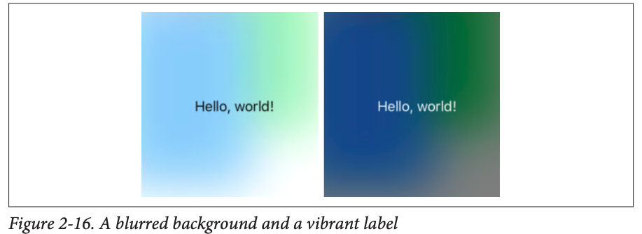

```swift
let blurEffect = UIBlurEffect(style: .systemThinMaterial)
let blurView = UIVisualEffectView(effect: blurEffect)
blurView.frame = view.bounds
blurView.autoresizingMask = [.flexibleWidth, .flexibleHeight]
view.addSubview(blurView)

let vibrancyEffect = UIVibrancyEffect(blurEffect: blurEffect, style: .label)
let vibrancyView = UIVisualEffectView(effect: vibrancyEffect)

let label = UILabel()
label.text = "Hello, world!"
label.sizeToFit()

vibrancyView.bounds = label.bounds
vibrancyView.center = view.bounds.center
vibrancyView.autoresizingMask = [
    .flexibleTopMargin, .flexibleBottomMargin,
    .flexibleLeftMargin, .flexibleRightMargin
]

blurView.contentView.addSubview(vibrancyView)
vibrancyView.contentView.addSubview(label)
```

图 2-16 展示了在浅色和深色模式下的效果。

在 nib 编辑器的对象库中，你既可以直接使用 `UIVisualEffectView`，也可以使用嵌套了 `UIVibrancyEffectView` 的 `UIVisualEffectView`。

## Drawing a UIView
到目前为止，本章的大多数绘图示例都是生成了 `UIImage` 对象。但正如之前提到的，`UIView` 本身就提供了一个绘图上下文，你在其中绘制的内容会直接呈现在该视图上。实现方式是创建一个 `UIView` 的子类，并在其中重写 `draw(_:)` 方法。这样，无论是系统决定重绘，还是你调用 `setNeedsDisplay`，都会触发该方法，由你的子类代码来决定如何绘制视图。`draw(_:)` 方法里做的任何绘制，都会成为界面上最终显示的内容。

当你重写 `draw(_:)` 方法时，通常不需要调用 `super`，因为 `UIView` 默认的 `draw(_:)` 实现是空的。系统调用 `draw(_:)` 时，当前的图形上下文已经被设置为该视图自己的上下文。你可以在这个上下文中使用 Core Graphics 函数或 UIKit 的便捷方法进行绘制。前面第96页“Graphics Contexts”一节中已有一些基础示例。

按需实时绘制可能会让一些初学者感到意外，他们担心绘制操作会很耗时。这种担忧确实有道理，如果同样的绘制内容要在界面中多处使用，那么更好的做法是先生成一次 `UIImage`，然后在视图的 `draw(_:)` 中反复绘制这个 `UIImage`。

一般来说，不要过早进行性能优化。看起来冗长的绘图代码往往执行得非常快。而且，iOS 的绘图系统效率很高；它只有在必要时才会调用 `draw(_:)`（或者你显式调用 `setNeedsDisplay` 时才会触发），并且视图完成绘制后会将结果缓存下来，下次就直接重用这份缓存，而不会重新执行绘制操作。（苹果将这份缓存称为视图的“位图后备存储”。）你可以在自己的 `draw(_:)` 实现里加几行日志来验证——你可能会惊讶地发现，自定义的 `UIView` 的 `draw(_:)` 在整个应用运行期间竟然只会被调用一次！

实际上，把绘制逻辑放到 `draw(_:)` 方法中，往往能提高效率。这是因为绘图引擎直接在屏幕上渲染，比先在离屏缓冲区渲染再将像素复制到屏幕上要高效得多。

以下是关于 `UIView` 的 `draw(_:)` 方法的三个重要注意事项：
* 不要自己直接调用 `draw(_:)`。如果视图需要更新，并且你想触发它的 `draw(_:)` 方法，应给视图发送 `setNeedsDisplay` 消息，系统会在下一个合适的时机自动调用 `draw(_:)`。
* 除非确定这样做合法，否则不要重写 `draw(_:)` 方法。比如，在 `UIImageView` 的子类中重写 `draw(_:)` 就是不允许的，因为你无法将自定义绘图与 `UIImageView` 本身的绘制逻辑合并。
* 在 `draw(_:)` 中不要做除绘制之外的任何操作。这是初学者常见的错误。像设置视图的 `backgroundColor`，或者添加子视图、子图层等配置，都应该放在其他地方完成，比如在重写初始化方法时进行。

当绘制工作量较大且可以拆分成若干区域时，你可以通过关注传入 `draw(_:)` 的参数来获得额外的效率提升。该参数是一个 `CGRect`，用于指定视图边界中需要刷新的区域。通常情况下，这个区域就是视图的整个 bounds；但如果你调用带有 `CGRect` 参数的 `setNeedsDisplay(_:)`，那么系统只会刷新你传入的那部分区域。你可以选择只在该区域内进行绘制；即便仍然对整个视图执行绘制操作，绘制内容也会被裁剪到指定区域内，这样虽然绘制所花时间未必减少，但渲染过程会更加高效。

当你在自定义的 `UIView` 子类中实现了 `draw(_:)` 方法，并在代码里创建该子类的实例时，可能会惊讶（甚至恼火）地发现视图的背景是黑色的！这往往让初学者感到困惑。黑色背景通常出现在以下两种情况同时满足时：
* 视图的 `backgroundColor` 为 nil
* 视图的 `isOpaque `为 true

当通过`init(frame:)`在代码中创建`UIView`时，默认这两个属性都是 true。如果你遇到黑色背景的问题并想去除它，可以重写`init(frame:)`，在其中将视图的`isOpaque`属性设置为 false。
```swift
class MyView: UIView {
    override init(frame: CGRect) {
        super.init(frame: frame)
        self.isOpaque = false
    }

    required init?(coder: NSCoder) {
        fatalError("init(coder:) has not been implemented")
    }
}
```

反之，如果在 nib 中创建 `UIView`，就不会出现黑色背景的问题。这是因为 nib 会为视图的 `backgroundColor` 赋予一个实际的值，即使该值是 `UIColor.clear`，也不会是 nil。

## Graphics Context Commands
每当你进行绘图时，其实就是在向绘图上下文发送绘制指令。无论是使用 UIKit 的方法，还是调用 Core Graphics 的函数，原理都是一样的。学习绘图的关键就在于理解绘图上下文的工作方式，本节内容正是围绕这一点展开。

在底层，Core Graphics 向绘图上下文发出的命令其实是一些全局 C 函数，例如 `CGContextSetFillColor`。但在 Swift 中，这些函数经过“重命名”处理后，就像把 `CGContext` 当作一个真正的对象来看待，而原来的全局函数则变成了 `CGContext` 的实例方法。此外，得益于 Swift 的重载机制，多个函数被合并为同一个方法；比如 `CGContextSetFillColor`、`CGContextSetFillColorWithColor`、`CGContextSetRGBFillColor` 和 `CGContextSetGrayFillColor` 都对应为同一个 `setFillColor`。

#### Graphics Context Settings
当你在图形上下文中绘制时，所有绘图都会遵循上下文当前的配置。因此，正确的流程是先对上下文进行设置，再执行绘制操作。举例来说，如果想先画一条红线再画一条蓝线，你应当先将上下文的线条颜色设为红色并绘制第一条线，然后将线条颜色改为蓝色并绘制第二条线。乍一看，好像红色和蓝色是各条线段自身的属性，但其实在绘制时，颜色始终是整个图形上下文的状态。

图形上下文在任何时刻都有一个“状态”，它囊括了该上下文所有当前的设置；一段绘制的最终效果，正是由执行该段绘制时图形上下文的状态决定的。为了方便对整个状态进行操作，图形上下文提供了一个状态栈。每当你调用 `saveGState()` 时，上下文就会将当前状态压入栈中；每当你调用 `restoreGState()` 时，上下文就会从栈顶弹出并恢复最近保存的状态。一个常见的模式是：
1. 调用 `saveGState()`
2. 修改上下文的设置，从而改变其状态
3. 执行绘制
4. 调用 `restoreGState()` 将状态和设置恢复到修改前的样子

并非每次修改上下文设置都必须在前调用 `saveGState()` 并在后调用 `restoreGState()`，因为大多数设置之间并不会相互冲突。你可以先把上下文的线条颜色设为红色，然后再改为蓝色，毫无问题。但在某些场景下，你确实需要让对设置的修改可撤销，我将在本章后面指出几个这样的场景。

构成图形上下文状态的许多设置，与任何绘图应用中的配置类似，它们决定了在当前时刻执行的绘制操作的行为和外观。以下是一些常见的图形上下文状态设置，以及对应的控制命令（括号中为 UIKit 提供的属性或方法）：
* 线条粗细和虚线样式
  * `setLineWidth(_:)`、`setLineDash(phase:lengths:)`
  * `UIBezierPath` 的 `lineWidth`、`setLineDash(_:count:phase:)`
  
* 线段端点样式和拐角连接样式
  * `setLineCap(_:)`、`setLineJoin(_:)`、`setMiterLimit(_:)`
  * `UIBezierPath` 的 `lineCapStyle`、`lineJoinStyle`、`miterLimit`

* 线条颜色或图案
  * `setStrokeColor(_:)`、`setStrokePattern(_:colorComponents:)`
  * `UIColor` 的 `setStroke()`

* 填充颜色或图案
  * `setFillColor(_:)`、`setFillPattern(_:colorComponents:)`
  * `UIColor` 的 `setFill()`

* 阴影
  * `setShadow(offset:blur:color:)`

* 全局透明度和混合模式
  * `setAlpha(_:)`、`setBlendMode(_:)`

* 抗锯齿
  * `setShouldAntialias(_:)`

* 其他设置还包括：
  * 裁剪区域：超出裁剪区域的部分不会被实际绘制

* 坐标变换（CTM，即“当前变换矩阵”）
  * 决定后续绘制命令中指定的点如何映射到画布的物理空间

这些设置中的许多将在本章后面通过示例进行说明。

#### Paths and Shapes
你可以通过一系列移动一支虚拟“画笔”的指令来构造一条路径，这条路径会从一个点到另一个点被逐渐勾勒出来。首先，你需要告诉这支画笔该从哪里开始，也就是设定一个“当前点”；接下来，每一条绘制路径的指令默认都是从这个当前点开始，绘制结束的位置又会变成新的当前点，以此类推，一段接着一段地构成完整的路径。


## Points and Pixels

## Content Mode

